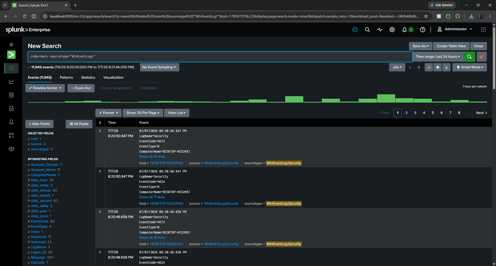
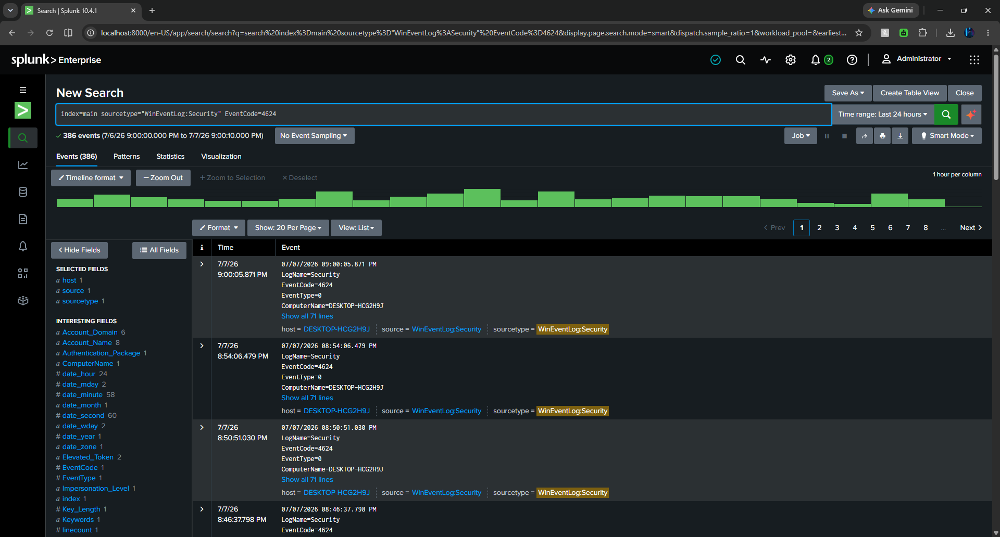
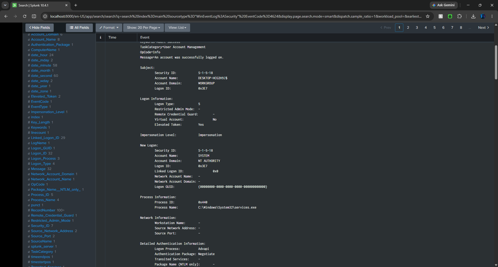
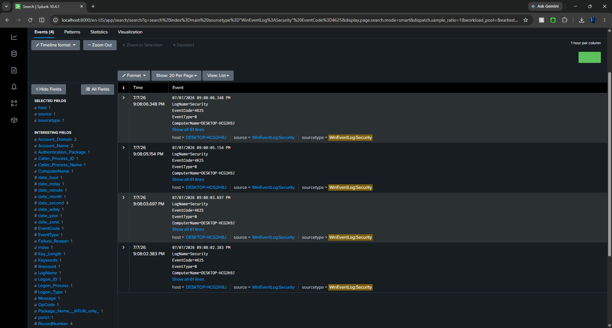
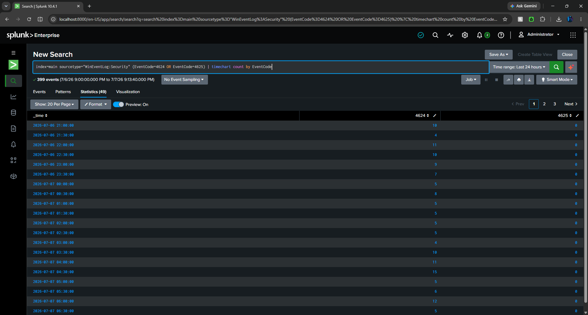
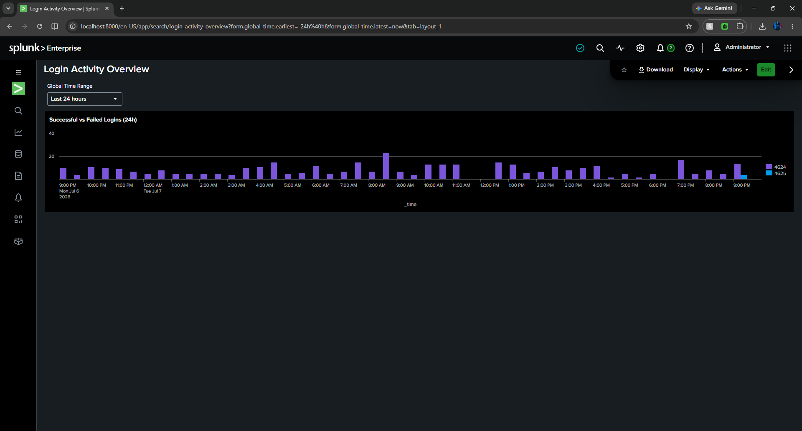

# SIEM Home Lab — Splunk Log Monitoring

A hands-on home lab using **Splunk Enterprise 10.4.1** to ingest and analyze Windows Event Logs, practice SPL (Search Processing Language), and build a security monitoring dashboard.

## Objective

Gain practical experience with core SOC analyst workflows: log ingestion, authentication event analysis, and visualization — using real data from my own machine rather than a pre-packaged dataset.

## Lab Setup

| Component | Detail |
|---|---|
| SIEM | Splunk Enterprise 10.4.1 (trial/free license) |
| Host | Windows 11 desktop (single-instance, standalone) |
| Data sources | Windows Event Logs: Security, System, Application |
| Ingestion method | Local Event Log Collection (Settings → Data Inputs) |
| Volume observed | ~12,000 events per 24 hours |

## What I Did

### 1. Log ingestion
Configured Local Event Log Collection for the **Security**, **System**, and **Application** channels, indexed to `main`. Verified ingestion with:

```spl
index=main sourcetype="WinEventLog*"
```

Result: 11,943 events over 24 hours across three sourcetypes.

### 2. Authentication analysis (EventCode 4624 / 4625)

**Successful logons:**
```spl
index=main sourcetype="WinEventLog:Security" EventCode=4624
```

386 successful logon events in 24 hours — far more than expected for a single-user machine. Drilling into the events showed most were **Logon Type 5 (service logons)** by the `SYSTEM` account via `services.exe`. Key takeaway: raw logon volume is meaningless without filtering by logon type — interactive logons (Type 2) tell a very different story than background service activity.

**Failed logons:**
```spl
index=main sourcetype="WinEventLog:Security" EventCode=4625
```

To generate real detection data, I deliberately entered wrong passwords at the lock screen. The result: a burst of 4 failed logon events within ~4 seconds, each carrying `Failure_Reason`, the calling process, and the target account — exactly the pattern a brute-force detection rule would key on.

### 3. Trend visualization

```spl
index=main sourcetype="WinEventLog:Security" (EventCode=4624 OR EventCode=4625)
| timechart count by EventCode
```

Saved as a dashboard panel to compare successful vs. failed authentication over time.

### 4. Dashboard

Built the **Login Activity Overview** dashboard with a global time-range picker:
- **Successful vs Failed Logins (24h)** — column chart of 4624 vs 4625 over time; the failed-login test burst is clearly visible as an anomaly against the baseline.
- **Top Accounts by Logon Count** — `| top limit=10 Account_Name` to show which accounts authenticate most.

## Screenshots

<!-- Add your screenshots to a /screenshots folder and they'll render below -->







## What I Learned

- **Volume ≠ signal.** 386 "logins" a day on an idle machine is normal once you understand logon types. Filtering and enrichment come before alerting.
- **Failure context matters.** Windows logs *why* a logon failed and *what process* requested it — enough to distinguish a typo from automated credential guessing.
- **SPL fundamentals**: filtering by sourcetype and EventCode, `timechart`, `top`, and saving searches as dashboard panels.

## Next Steps

- [ ] Ingest Sysmon logs for process-level visibility
- [ ] Build a scheduled alert for ≥5 failed logons within 60 seconds
- [ ] Map observed event types to MITRE ATT&CK techniques (T1110 — Brute Force)
- [ ] Companion project: network traffic analysis with Wireshark
